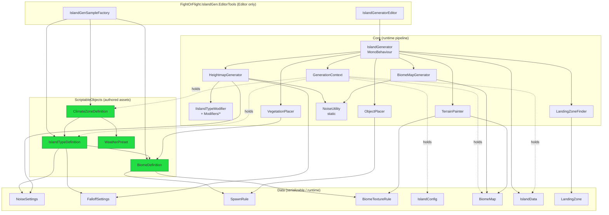

# IslandGen — Procedural Island Generation Architecture

> System for procedurally generating unique, **air-readable** islands for the
> co-op cargo-pilot game. Each island is a real Unity `Terrain` built from a
> seed so that it is reproducible and (later) identical across networked peers.
>
> **Status:** design baseline. This document is the contract; code follows it.
> **Namespace:** `FightOrFlight.IslandGen` (runtime), `FightOrFlight.IslandGen.EditorTools` (editor).
> **Conventions inherited from the project:** heightmaps are `float[z, x]` normalized `0..1`;
> namespaces are `FightOrFlight.<Area>`; no third-party packages (Unity Terrain API + `Mathf`/`System` only).

---

## 1. Design goals & non-goals

**Goals**
- Three-level conceptual hierarchy drives everything: **ClimateZone → IslandType → Biome[]**.
- An island is **readable from the air**: silhouette (heightmap shape), texturing (splat),
  and vegetation must all reinforce "this is an arctic ice plateau" vs "this is a desert canyon".
- **Data-driven**: a new biome or a new island type is added by authoring a ScriptableObject,
  not by editing code. Zero magic numbers in code — all tunables live on SOs.
- **Seed-reproducible**: same `IslandConfig.seed` ⇒ byte-identical terrain.
- Runs in **Editor** (inspector buttons) and at **runtime**, **without freezing** the main
  thread (coroutine pipeline with progress callback).
- Always yields **≥ 1 landing zone** per island.

**Non-goals (this system)**
- Not the world-streaming/chunk system (`Assets/Scripts/Streaming/*`) — that streams one large
  world. IslandGen builds **discrete per-island Terrains**. They share *conventions* (`[z,x]`,
  normalized heights, slope sampling) but not code.
- Not the weather runtime. IslandGen only *emits* a `WeatherPreset` reference for `WeatherSystem`.
- No networking code here. The seed is the sync surface; replication is the caller's concern.

---

## 2. Folder & assembly layout

```
Assets/IslandGen/
├── Core/            Runtime orchestration + generation stages (asmdef: FightOrFlight.IslandGen)
│   ├── IslandGenerator.cs           MonoBehaviour entry point / orchestrator
│   ├── GenerationContext.cs         Mutable bag threaded through all stages
│   ├── HeightmapGenerator.cs        Perlin + falloff + IslandType modifiers → float[z,x]
│   ├── IIslandTypeModifier.cs       Hook for per-IslandType heightmap shaping
│   ├── Modifiers/                   Concrete modifiers (Canyon, Plateau, Volcano, Fjord, …)
│   ├── BiomeMapGenerator.cs         temperature+moisture noise → BiomeMap
│   ├── TerrainPainter.cs            BiomeMap + slope/height rules → alphamaps
│   ├── VegetationPlacer.cs          TreePrototypes + DetailPrototypes via Terrain API
│   ├── ObjectPlacer.cs              GameObject spawns from SpawnRule
│   └── LandingZoneFinder.cs         flat-area detection + flattening + markers
├── Data/            Plain serializable data (asmdef shares FightOrFlight.IslandGen)
│   ├── NoiseSettings.cs             [Serializable] octaves/persistence/lacunarity/scale
│   ├── FalloffSettings.cs           [Serializable] circular falloff params
│   ├── SpawnRule.cs                 [Serializable] prefab/density/slope/height constraints
│   ├── BiomeTextureRule.cs          [Serializable] layer + slope/height band
│   ├── BiomeMap.cs                  runtime result of BiomeMapGenerator
│   ├── IslandConfig.cs              generation INPUT (seed,size,res,climate)
│   ├── IslandData.cs                generation OUTPUT (zones, landing spots, refs)
│   └── LandingZone.cs               one landing pad descriptor
├── ScriptableObjects/  SO type definitions
│   ├── ClimateZoneDefinition.cs
│   ├── IslandTypeDefinition.cs
│   ├── BiomeDefinition.cs
│   └── WeatherPreset.cs             (lightweight stub the WeatherSystem will own later)
├── Editor/          (asmdef: FightOrFlight.IslandGen.EditorTools, Editor-only)
│   ├── IslandGeneratorEditor.cs     Generate / Clear / Randomize Seed buttons
│   └── IslandGenSampleFactory.cs    Menu: builds the two sample islands' SO assets
├── Prefabs/         WorldGenerator/IslandRoot prefab(s), placeable object prefabs
├── Terrain/         Generated TerrainData + TerrainLayer assets (+ debug textures)
└── Assets created at runtime are NOT saved here unless via the sample factory.
```

Two assembly definitions keep editor code out of the build:
`FightOrFlight.IslandGen.asmdef` (Core+Data+ScriptableObjects) and
`FightOrFlight.IslandGen.EditorTools.asmdef` (`includePlatforms: [Editor]`, references the first).

---

## 3. Conceptual hierarchy → data model

```
ClimateZoneDefinition            (LEVEL 1: vibe + atmosphere)
   • allowedIslandTypes : weighted[ IslandTypeDefinition ]
   • weatherPreset, ambient/fog/lighting hints
   • temperatureRange, moistureBias            ← shifts the Whittaker lookup
        │  (seed-weighted pick)
        ▼
IslandTypeDefinition             (LEVEL 2: macro-geology / silhouette)
   • baseNoise : NoiseSettings, falloff : FalloffSettings
   • heightModifierType (enum) + modifier params  → ridge/plateau/volcano/…
   • allowedBiomes : BiomeDefinition[]           ← palette for this island
   • heightMeters (vertical scale), seaLevel01
        │
        ▼
BiomeDefinition[]                (LEVEL 3: zones coexisting on the island)
   • whittaker cell: minTemp/maxTemp, minMoist/maxMoist  ← placement in biome map
   • textureRules : BiomeTextureRule[]  (base/cliff/cap/detail by slope+height)
   • treePrototypes, detailPrototypes
   • objectSpawnRules : SpawnRule[]
   • tint (for debug colormap), landingFriendliness
```

A biome is selected per terrain cell by a Whittaker-style lookup: `temperature×moisture`
noise indexes into the island's `allowedBiomes`, each of which declares the temp/moisture
rectangle it occupies. ClimateZone shifts that lookup (arctic biases cold/low-moisture).

---

## 4. Class dependency graph



ASCII fallback (dependency direction = "uses / reads"):

```
IslandGeneratorEditor ─► IslandGenerator ─► GenerationContext (shared mutable state)
                                  │
   ┌──────────────────────────────┼───────────────────────────────────────────┐
   ▼            ▼            ▼     ▼      ▼            ▼            ▼            ▼
Heightmap   BiomeMap   Terrain  Veget.  Object   LandingZone   (writes)   IslandData
Generator   Generator  Painter  Placer  Placer   Finder                  (result)
   │            │          │        │       │          │
   ▼            ▼          ▼        ▼       ▼          ▼
NoiseUtility  NoiseUtil  BiomeMap  Biome   SpawnRule  LandingZone
+ IIsland-    + Climate  + Biome   Defin.
TypeModifier  shift      TextureRule
```

Dependency rules: **Core depends on Data and SO; Data depends on nothing in Core;
SO depends only on Data + UnityEngine.** No cycles. Editor depends on everything, nothing
depends on Editor.

---

## 5. Class responsibilities

### 5.1 ScriptableObjects

**`ClimateZoneDefinition`** — *vibe + atmosphere; level 1.*
- Fields: `string displayName`; `WeightedIslandType[] allowedIslandTypes` (each = `{IslandTypeDefinition type; float weight;}`); `WeatherPreset weatherPreset`; `Gradient ambientGradient`; `Color fogColor`; `float fogDensity`; `Vector2 temperatureRange`; `Vector2 moistureRange`; `Color minimapTint`.
- Methods: `IslandTypeDefinition PickIslandType(System.Random rng)` (weighted draw).

**`IslandTypeDefinition`** — *macro-geology / silhouette; level 2.*
- Fields: `string displayName`; `NoiseSettings baseNoise`; `FalloffSettings falloff`; `HeightModifier modifierType` (enum: `None, CanyonRidges, Plateau, Volcano, Fjord, Atoll, Badlands`); `AnimationCurve heightRemap`; `float heightMeters`; `[Range0..1] float seaLevel01`; `BiomeDefinition[] allowedBiomes`; modifier params (`float ridgeSharpness`, `float plateauClip`, `float craterRadius01`, …) grouped in a small serializable `ModifierParams` struct.
- Methods: `IIslandTypeModifier CreateModifier()` (factory mapping enum→modifier instance).

**`BiomeDefinition`** — *one zone; level 3.*
- Fields: `string displayName`; Whittaker cell `Vector2 temperatureRange, moistureRange`; `BiomeTextureRule[] textureRules`; `TreePrototypeDef[] trees`; `DetailPrototypeDef[] details`; `SpawnRule[] objectRules`; `Color debugTint`; `[Range0..1] float landingFriendliness`.
- Methods: `float MatchScore(float temp, float moist)` (distance to its cell center, used for blend).

**`WeatherPreset`** — minimal stub (fog/storm/icing flags + intensities) so IslandData can
carry a reference for the future `WeatherSystem`. Owned conceptually by weather; lives here only
until that system exists.

### 5.2 Data (serializable / runtime)

- **`NoiseSettings`** `[Serializable]` — `float scale; int octaves; [Range0..1] float persistence; float lacunarity; Vector2 offset; bool ridged;`. Pure tunables, no logic.
- **`FalloffSettings`** `[Serializable]` — `float radius01 (where falloff starts); float falloffPower; float edgeSharpness; bool circular;`.
- **`SpawnRule`** `[Serializable]` — `GameObject prefab; float density (per 100 m²); float minSlope,maxSlope; float minHeight01,maxHeight01; bool alignToNormal; bool randomYaw; Vector2 scaleRange; int maxCount;`.
- **`BiomeTextureRule`** `[Serializable]` — `TerrainLayer layer; float minSlope,maxSlope; float minHeight01,maxHeight01; float strength;`. The painter evaluates each rule; matching rules contribute weight.
- **`BiomeMap`** (class) — result of stage 2: `int resolution; byte[,] primary; byte[,] secondary; float[,] blend; BiomeDefinition[] palette; float[,] temperature; float[,] moisture;`. Helpers: `BiomeDefinition PrimaryAt(x,z)`, `Color DebugColorAt(x,z)`.
- **`IslandConfig`** `[Serializable]` — INPUT: `int seed; int heightmapResolution (513/1025/2049); int alphamapResolution; float sizeMeters; ClimateZoneDefinition climate; IslandTypeDefinition forcedType (optional override);`.
- **`IslandData`** (class) — OUTPUT: `int seed; Terrain terrain; ClimateZoneDefinition climate; IslandTypeDefinition islandType; BiomeMap biomeMap; List<LandingZone> landingZones; WeatherPreset weather; Bounds worldBounds;`.
- **`LandingZone`** (class/struct) — `Vector3 center; float radius; float averageSlope; Transform marker;`.

### 5.3 Core pipeline

- **`IslandGenerator`** (MonoBehaviour) — orchestrator + the only public entry point.
  - Serialized: `IslandConfig config; Transform islandRoot; Material terrainMaterialTemplate; bool generateOnStart; int buildBudgetPerFrame;`.
  - Public: `void Generate()`, `IEnumerator GenerateAsync(System.Action<float,string> onProgress = null, System.Action<IslandData> onComplete = null)`, `void Clear()`, `IslandData Result {get;}`.
  - Creates `TerrainData`/`Terrain`, builds `GenerationContext`, runs stages in order, yields between/within stages to honor `buildBudgetPerFrame`, logs each stage with `[IslandGen]` + ms timings.
- **`GenerationContext`** — mutable struct/class threaded through stages. Holds `IslandConfig`, resolved `climate`/`islandType`, `System.Random rng` + derived per-stage seeds, `Terrain`, `TerrainData`, `float[,] heights`, `BiomeMap`, `IslandData`, and `void Report(float p, string stage)`.
- **`HeightmapGenerator`** — `float[,] Generate(GenerationContext ctx)`: multi-octave Perlin (`NoiseUtility.FractalNoise`) → apply `IIslandTypeModifier` → multiply by circular falloff → `heightRemap` curve → clamp. Returns `[z,x]` normalized.
- **`IIslandTypeModifier`** + `Modifiers/*` — `float Apply(float height01, float nx, float nz, NoiseContext n, ModifierParams p)`. Concrete: `CanyonModifier` (ridge noise carves steep gorges), `PlateauModifier` (clip tops flat), `VolcanoModifier` (radial cone + crater), `FjordModifier`, `AtollModifier`, `BadlandsModifier`, `NullModifier`.
- **`BiomeMapGenerator`** — `BiomeMap Generate(GenerationContext ctx)`: two more noise fields (temperature, moisture) shifted by `climate.temperatureRange/moistureRange`; for each cell score every `allowedBiome.MatchScore`, take top-2 → `primary/secondary/blend`. Optionally folds elevation into temperature (higher = colder).
- **`TerrainPainter`** — `void Paint(GenerationContext ctx)`: builds the union `TerrainLayer[]` palette, allocates `float[res,res,nLayers]`, per cell mixes biome primary/secondary weights × each biome's matching `BiomeTextureRule`s (slope+height gated) → normalize → `terrainData.SetAlphamaps`.
- **`VegetationPlacer`** — registers `TreePrototype[]`/`DetailPrototype[]` on `TerrainData`, then scatters trees (`TreeInstance`) and paints detail layers (`SetDetailLayer`) per biome, respecting slope/height. Uses Terrain API only.
- **`ObjectPlacer`** — Poisson-ish scatter of `SpawnRule.prefab` GameObjects under `islandRoot`, sampling terrain height+normal, gating by slope/height, aligning to normal, random yaw/scale, honoring `maxCount`.
- **`LandingZoneFinder`** — scans slope map for connected flat regions (slope < threshold, area ≥ min); if none qualifies, **forces** one by flattening a disc near a biome with high `landingFriendliness`; spawns a marker prefab and records `LandingZone` into `IslandData`. Runs *before* ObjectPlacer so objects avoid pads.
- **`NoiseUtility`** (static) — `float FractalNoise(x,z,NoiseSettings,seedOffset)`, `float Ridge(float n)`, `float Falloff(nx,nz,FalloffSettings)`, seed→offset helpers. Pure, deterministic, no Unity state.

---

## 6. Generation order (call sequence)

```
IslandGenerator.Generate()  ── or GenerateAsync(onProgress,onComplete)
 │
 0. Resolve config
 │     rng = new System.Random(config.seed)
 │     islandType = config.forcedType ?? climate.PickIslandType(rng)
 │     create TerrainData (heightmapResolution, size = sizeMeters×heightMeters×sizeMeters)
 │     create Terrain GameObject under islandRoot; assign material template
 │     ctx = new GenerationContext(config, climate, islandType, rng, terrain, terrainData)
 │
 1. heights = HeightmapGenerator.Generate(ctx)            [Report 0.10 "Heightmap"]
 │     fractal Perlin → IIslandTypeModifier.Apply → ×Falloff → heightRemap
 │     terrainData.SetHeights(0,0, heights)
 │
 2. biomeMap = BiomeMapGenerator.Generate(ctx)            [Report 0.35 "Biomes"]
 │     temp/moist noise (+climate shift, +elevation) → top-2 biome per cell
 │
 3. LandingZoneFinder.Find(ctx)                           [Report 0.50 "Landing zones"]
 │     detect flats; guarantee ≥1 (flatten if needed → re-SetHeights of patch)
 │     (runs before paint so painter sees the flattened pad)
 │
 4. TerrainPainter.Paint(ctx)                             [Report 0.70 "Texturing"]
 │     union TerrainLayers → alphamaps from biome × slope × height → SetAlphamaps
 │
 5. VegetationPlacer.Place(ctx)                           [Report 0.85 "Vegetation"]
 │     TreePrototypes + DetailPrototypes; scatter respecting slope/height & pads
 │
 6. ObjectPlacer.Place(ctx)                               [Report 0.95 "Objects"]
 │     SpawnRule GameObjects under islandRoot, normal-aligned, pad-avoiding
 │
 7. ctx.BuildIslandData() → Result; onComplete(IslandData) [Report 1.00 "Done"]
```

Every stage logs `[IslandGen] <stage> done in <ms> ms`. The async variant yields after each
stage and inside the heavy double-loops every `buildBudgetPerFrame` rows so the editor/runtime
stays responsive. Determinism is preserved because each stage derives its own sub-seed from
`config.seed` (stage index mixed in) — yielding never changes the RNG sequence.

---

## 7. ScriptableObject assets to author

Sample factory (`Tools ▸ IslandGen ▸ Create Sample Islands`) creates real `.asset` files:

| Asset | Type | Notes |
|---|---|---|
| `Arctic` | ClimateZoneDefinition | cold temp range, low moisture, icy fog `WeatherPreset` |
| `Desert` | ClimateZoneDefinition | hot temp range, very low moisture, heat-haze preset |
| `IcePlateau` | IslandTypeDefinition | smooth base noise, `Plateau` modifier, allowedBiomes = {IceField, Tundra, SnowMountains} |
| `GrandCanyon` | IslandTypeDefinition | `CanyonRidges` modifier, allowedBiomes = {FlatDesert, Canyon, Badlands} |
| `IceField` `Tundra` `SnowMountains` | BiomeDefinition ×3 | snow/ice TerrainLayers, sparse pines, rocks |
| `FlatDesert` `Canyon` `Badlands` | BiomeDefinition ×3 | sand/rock TerrainLayers, sparse shrubs, boulders |
| `WeatherPreset` ×2 | WeatherPreset | Blizzard, HeatHaze |
| TerrainLayers | TerrainLayer | snow, ice, rock-cliff, sand, sand-cliff, mud (built or placeholder) |

Two test islands therefore:
1. **Arctic / IcePlateau** — broad flat-topped white plateau, gentle, easy pads.
2. **Desert / GrandCanyon** — sharp ridged ochre gorges, narrow flats, scarce pads.

These must be obviously different from the air (criterion in the brief).

---

## 8. Extensibility (how to add content)

- **New biome:** create a `BiomeDefinition` asset, set its Whittaker temp/moisture cell,
  texture rules, trees/details/objects; add it to an `IslandTypeDefinition.allowedBiomes`.
  *No code.*
- **New island type with existing geology:** create an `IslandTypeDefinition`, pick an existing
  `HeightModifier` enum value + params, set noise/falloff/biomes; add to a climate's
  `allowedIslandTypes`. *No code.*
- **New island type needing novel geology:** add an enum value to `HeightModifier`, implement an
  `IIslandTypeModifier` in `Core/Modifiers/`, wire it in `IslandTypeDefinition.CreateModifier()`.
  *One modifier class + one enum entry.*
- **New climate:** create a `ClimateZoneDefinition`, point it at island types + a weather preset.

---

## 9. Open decisions / risks

- **Terrain vs. mesh:** committed to Unity `Terrain` (brief mandates Terrain Layers / TreePrototype /
  Detail meshes). Heavier than the Streaming mesh path but matches the requirement and tooling.
- **Blend fidelity:** storing top-2 biomes (not full per-biome weight volume) keeps memory at
  `O(res²)` and gives smooth 2-way transitions; 3-way junctions snap to the stronger pair. Acceptable.
- **URP foliage caveat (project memory):** URP may not render Terrain trees/grass. Vegetation uses
  Terrain prototypes per the brief; if URP drops them visually we fall back to `ObjectPlacer`
  GameObjects for hero vegetation. Tracked, not blocking the architecture.
- **Async under MCP:** play-mode/coroutine stepping can stall under MCP (project memory); the
  editor "Generate" runs the pipeline synchronously (driving the coroutine to completion) so it
  works without entering Play Mode.
```
